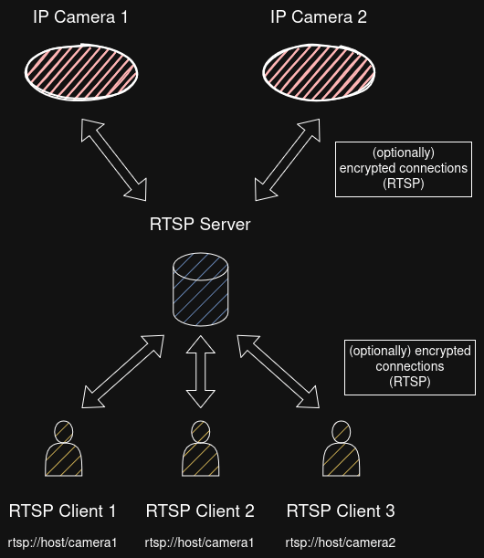
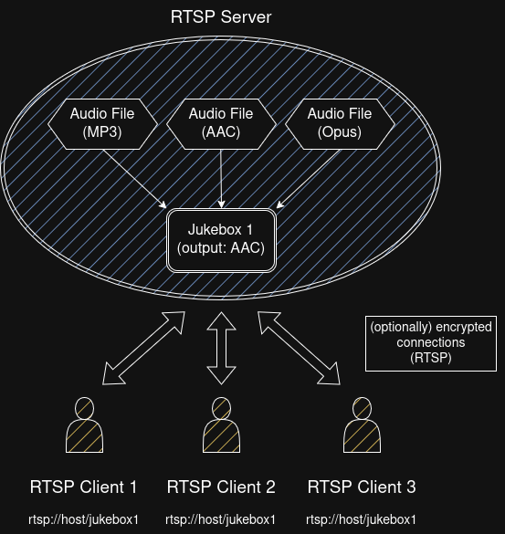
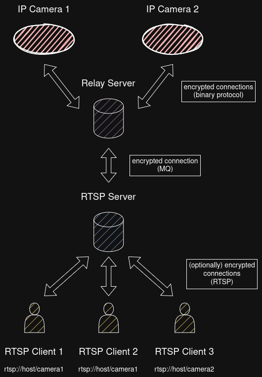

# Architecture

## Multicasting

The server performs multicasting for external sources to efficiently distribute data to multiple clients.  
This approach minimizes network traffic between the source and the server, thereby improving overall performance.

Multicasting is performed internally within the server and not on the networking layer.  
UDP multicast addresses are not supported.

## RTSP Input

External RTSP streams can be used as sources for output streams:

## Jukebox

Output streams can be configured as 'Jukebox'.  
All input files will then be converted into a common format and distributed to clients:

## External Message Queues

When using external Message Queues, the server will establish a single connection per channel (audio or video) and Message Queue:

